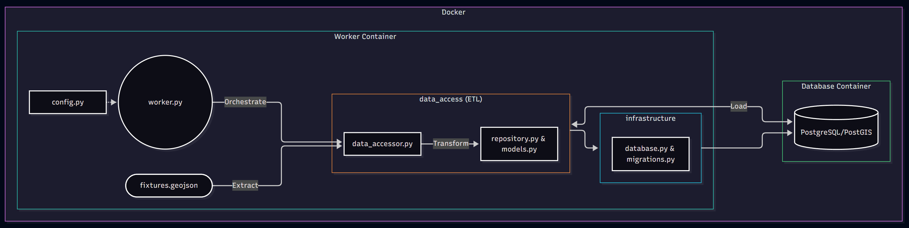
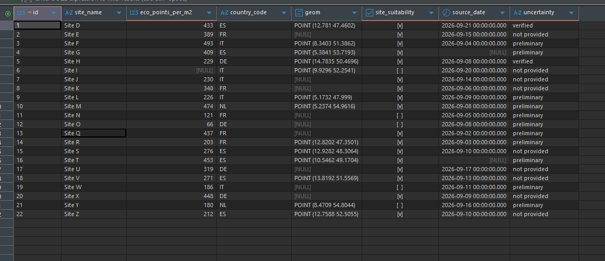
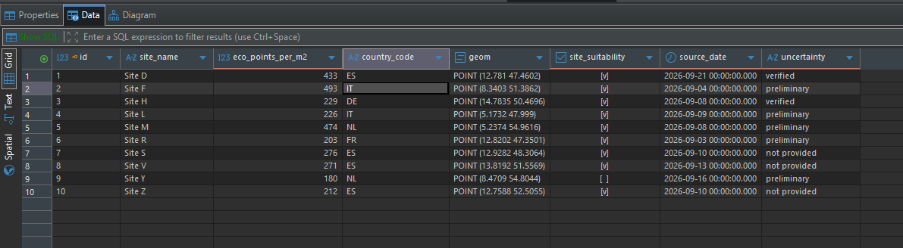

# IRIS Pilot Service - Portable Dockerized ETL Pipeline

This repository contains a robust, dockerized ETL (Extract, Transform, Load) pipeline built for the IRIS Pilot Service. The service extracts geospatial data, validates and transforms it using Pandas, and safely loads it into a PostGIS-enabled PostgreSQL database.

## Prerequisites
- **Docker** & **Docker Compose**
- **Git**

## Setup
1. Clone the repository:
   ```bash
   git clone https://github.com/MdSamiulHaque/IRIS-Pilot-Service.git
   cd IRIS-Pilot-Service
   ```
2. The repository includes two configuration templates: `.env.dev` (for local development) and `.env.prod` (for production deployment).
3. Copy the appropriate template to create your active `.env` file (which Docker uses):
   ```bash
   # For development:
   cp .env.dev .env
   
   # OR for production:
   cp .env.prod .env
   ```

> **Note:** The `.env.dev` and `.env.prod` files are included in this Git repository strictly for demonstration purposes. In a real-world scenario, environment configuration files should **definitely not** be committed to source control.

## Commands
To run the main application (ETL pipeline):
```bash
docker compose --profile app up --build -d
```
To run the automated smoke tests:
```bash
docker compose --profile test up smoke_test --build
```
*(Note: `sudo` is required on most Linux environments to avoid permission errors. If you are using Windows or macOS, you must omit `sudo`).*

## Architecture & Component Details



### Architectural Choices
- **Object-Oriented Programming (OOP) & Interfaces:** The code relies on abstractions (e.g., `SiteRepositoryInterface`) to decouple database logic from pipeline logic, making the system highly testable via mock implementations.
- **Repository Pattern:** Used to isolate the data access layer.
- **SQLAlchemy ORM:** Used for all database interactions instead of raw SQL strings, providing built-in protection against SQL injection attacks and ensuring clean schema definitions.
- **Environment-Driven Configuration:** Configs are loaded strictly from the `.env` file, ensuring no sensitive information is baked into the source code.

### How It Works (ETL Pipeline)
The `worker.py` script acts as the main orchestrator for the ETL process:
1. **Extract:** Reads the spatial data from a `.geojson` file (our mock source data).
2. **Transform:** Uses Pandas/GeoPandas to validate the data against explicit data contracts, evaluate site suitability based on `eco_points_per_m2`, and clean the data by strictly removing rows with `null` values in required fields.
3. **Load:** Passes the cleaned data to the Repository layer, which inserts it into the PostgreSQL/PostGIS database.

**Idempotency:**
The worker is fully idempotent. If you run it multiple times, it detects existing `site_name` entries and safely prevents duplicate database insertions. 

**Automated Smoke Tests:**
The `smoke_test` container spins up alongside the database. It is also completely idempotent and verifies:
- Database health and connectivity.
- Successful database schema initialization.
- The pipeline's ability to extract, clean, and insert data flawlessly.

### Data Cleaning in Action
Here is what the raw, uncleaned data looks like when it contains `[NULL]` values:



Here is the data after passing through the strict pipeline validation and contracts:



## Future Considerations
As the project scales into a full production environment, the following enterprise-grade improvements are recommended:
- **Continuous Execution:** Refactor the worker to remain running continuously as a background daemon (or trigger via cloud events) so that as soon as new data files arrive, they are instantly parsed into the database.
- **Secure Secrets Management:** Move all configuration files and credentials out of `.env` files and source control entirely. They should be accessed securely from a managed vault (e.g., **Azure Key Vault**) with strict Access Control.
- **Advanced Business Logic & Security:** Add deeper business validation layers, geospatial bounding box checks, and stricter security protocols to the pipeline.
- **Distributed Processing (Apache Spark):** If the data volume grows to massive terabyte-scale layers, the Pandas pipeline should be replaced with a distributed computing framework like Apache Spark to transform the data rapidly across a clustered infrastructure.

